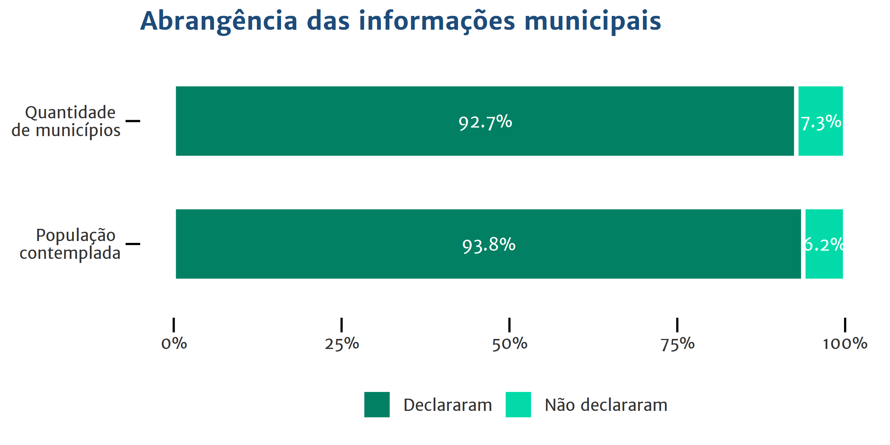

```{r setup, include=FALSE}
knitr::opts_chunk$set(
	echo = TRUE,
	message = FALSE,
	warning = FALSE
)
```

```{css, echo=FALSE}
body {
  font-family: 'Open Sans', sans-serif;
  line-height: 1.6em;
  max-width: 700px;
  margin-left: auto;
  margin-right: auto;
  padding-left: 20px;
  padding-right: 20px;
}

h1, h2, h3, h4 {
  color: #353E57 // #1E4C7A;
}

.hoverlayer:hover {
  font-family: "Open Sans Condensed";
}

.conceito {
    padding: 2px;
    background-color: lightblue;
    cursor: pointer;
}

.descricao {
    background-color: lightblue;
    margin: 8px;
    font-size: 0.9em;

}

del {
  color: lightgrey;
  text-decoration: none;
}

.descricao>p {
    padding: 0 8px;
    margin: 0px;
}

p.titulo-card {
    background-color: steelblue;
    color: white;
    margin: 0;
    font-weight: bold;
    letter-spacing: 0.2em;
}

p.fechar-card{
    background-color: lightsteelblue;
    color: lightgray;
    letter-spacing: 0.2em;
    margin: 0;
    text-align: right;
    font-size: 0.7em;
}

p.fechar-card>a{
    text-decoration: none;
    color: white;
}

h1 {
    padding-top: 20px;
    padding-bottom: 20px;
    margin: auto;
    text-align: center;
    position: relative;
    //font-style: italic;
    letter-spacing: 0.1em;
    line-height: 1.8em;
    font-size: 1.9em;
    font-family: "Vollkorn";
}

h1>em {
    font-size: 2em;
    color: firebrick;
    //text-transform: uppercase;
    letter-spacing: 0.1em;
    display: block;
    font-style:normal;
    padding-top: 0.1em;
    text-shadow: 0.07em 0.07em 0 rgba(0, 0, 0, 0.1);
}
    
h1>em::before, h1>em::after {
    content: "§";
    display: inline-block;
    -webkit-transform: rotate(90deg);
    -moz-transform: rotate(90deg);
    -o-transform: rotate(90deg);
    -ms-transform: rotate(90deg);
    transform: rotate(90deg);
        opacity: 0.2;
    margin: 0 0.6em;
    font-size: 0.5em;

}

img.abertura {
    margin-left: auto;
    margin-right: auto;
    display: block;
    width: 100%;
    height: auto;
}

.abertura p {
    text-align: center;
    font-size: 0.7em;
}

.descricao img {
  width: 80%;
  margin-left: auto;
  margin-right: auto;
  display: block;
  margin-top: 10px;
  margin-bottom: 10px;
}


```

```{r libraries}
library(tidyverse)
library(scales)
library(readxl)
#library(ipeaData)
library(extrafont)
library(RColorBrewer)
#library(ckanr)
#library(skimr)
library(shiny)
library(leaflet)
library(ggbeeswarm)
library(plotly)
library(viridis)
library(ggrepel)

tema <- function(){
    theme_minimal() +
    theme(
      text = element_text(family = "Open Sans", colour = "grey20"),
      title = element_text(face = "bold", size = 10, color = "#1E4C7A"), 
      plot.subtitle = element_text(family = "Open Sans Condensed", 
                                   color = "grey20", face = "plain", size = 10),
      axis.text = element_text(family = "Open Sans", colour = "grey20", size = 8),
      plot.caption = element_text(face = "italic"),
      panel.grid.major = element_blank(), 
      panel.grid.minor = element_blank(),
      legend.text = element_text(size = 8),
      legend.title = element_text(size = 8),
      axis.ticks = element_line(size = 0.5),
      axis.ticks.length = unit(.25, "cm"),
      axis.title = element_text(size = 8, colour = "grey20"),
      legend.position = 'none')
}

tema_gif <- function() {
  theme(legend.position = 'none',
        panel.grid.major.y = element_blank(),
        panel.grid.major.x = element_blank(),
        axis.title.y = element_blank(),
        axis.text.y = element_blank(),
        axis.ticks.y = element_blank(),
        plot.background = element_rect(color = "#f0f5f7", linetype = "solid", size = 2))
}

vermelho <- brewer.pal(3, name = "Set1")[1]
azul <- "#1f476a" 

vermelho_claro <- "#ee7576"
azul_claro     <- "#2c90bf" # "#87b1d4"

tres_cores <-c("#F8AC08","#028063","#6E287C")
tres_cores_pasteis <- c("#FECE60","#63BEAF", "#BE8EBF")

# estou comentando toda a leitura de dados externos para bypassar erro do Shiny. Salvei os dados em .RData e vou lê-los diretamente. 

# dados estados
# tabela_estados <- read.csv2("./dados/finbraRGF_estados.csv", skip = 5) %>%
#   mutate(Escopo    = "Estados",
#          Exercicio = 2018)

# dados municípios
#perfil_mun <- read_excel("./dados/Base MUNIC 2017.xls", sheet = "Variáveis externas")
#tabela_mun1 <- read.csv2("./dados/finbraRGF_mun.csv", skip = 5) 
#tabela_mun2 <- read.csv2("./dados/finbraRGF_mun_semestre.csv", skip = 5)

# dados uniao
#  tabela_uniao <- read.csv2("./dados/finbraRGF_uniao.csv", skip = 5) %>% 
#   mutate(Escopo    = "Uniao",
#          Exercicio = 2018)
# 
# save(list = c("tabela_estados", "tabela_uniao", "tabela_mun1", "tabela_mun2", "perfil_mun"), file = "dados.RData")

# bloco para resolver problemas do shiny
load("dados.RData")
names(tabela_mun1) <- c("Instituicao", "Cod.IBGE", "UF", "PODER", "Populacao", "Coluna", 
"Conta", "Valor")
names(tabela_mun2) <- c("Instituicao", "Cod.IBGE", "UF", "PODER", "Populacao", "Coluna", 
"Conta", "Valor")
names(tabela_uniao) <- c("Instituicao", "Cod.IBGE", "UF", "PODER", "Populacao", "Coluna", 
"Conta", "Valor", "Escopo", "Exercicio")
names(tabela_estados) <- c("Instituicao", "Cod.IBGE", "UF", "PODER", "Populacao", "Coluna", 
"Conta", "Valor", "Escopo", "Exercicio")
#

tabela_mun <- rbind(tabela_mun1, tabela_mun2) %>%
  mutate(Escopo    = "Municípios",
         Exercicio = 2018)

# população atualizada
pop_UFs <- perfil_mun %>%
  group_by(UF, REGIAO) %>%
  summarise(pop = sum(`POP EST`))

tabela_estados <- tabela_estados %>%
  inner_join(pop_UFs) %>%
  mutate(`CLASSE POP` = NA)

tabela_municipios <- perfil_mun %>%
  select(Cod.IBGE = CodMun, REGIAO, pop = `POP EST`, `CLASSE POP`) %>%
  right_join(tabela_mun)

tabela_completa <- rbind(tabela_estados, tabela_municipios)

### depois melhorar isso aqui
# cabecalho_estados <- read.csv2("./dados/finbraRGF_estados.csv", nrows = 5, header = FALSE)
# cabecalho_estados <- cabecalho_estados %>% 
#   mutate(V1 = as.character(V1)) %>% 
#   separate(1, into = c("Info", "Valor"), sep = ":") %>% 
#   t() %>%
#   as.data.frame() %>%
#   select(-4)

#tabela_estados %>% skim()
#tabela_estados %>% str()
```
<h1><em>Dívidas</em>pra que te quero</h1>


<p style = "text-align: center; font-size: 0.7em;">Créditos da imagem: <a href="http://www.willtirando.com.br/" target="blank">William Leite</a></p>


Dívida é uma quantia que se tem de pagar a alguém. O que interessa bastante para esse ~~tal de~~ alguém. E ~~tomara~~ muito importante para quem deve. Caso você não seja nenhum dos dois, por que continuar lendo sobre esse assunto ~~espinhoso~~?

Vivemos em uma cidade, que tem uma prefeitura, certo? Essa cidade está dentro de um estado, que tem um governo. E isso tudo ~~incluindo você~~ fica em um país. Você teria curiosidade em saber o quanto nós devemos eles <span class="conceito" id="conceito-declaram">declaram</span> que devem?

<div class="descricao" id="descricao-declaram"> 
<p class="titulo-card">ABRANGÊNCIA DAS INFORMAÇÕES</p> 
<p>A principal fonte de dados deste painel é o Sistema de Informações Contábeis e Fiscais do Setor Público Brasileiro - SICONFI, em especial, os dados declarados pelos entes federativos através dos Relatórios de Gestão Fiscal - RGF.

As informações sobre os encargos e condições de contratação dos estados e municípios. por sua vez, estão disponíveis no módulo de Cadastro da Dívida Pública (CDP) do Sistema de Análise da Dívida Pública, Operações de Crédito e Garantias da União, Estados e Municípios (SADIPEM). O CDP recebe a declaração detalhada das dívidas dos estados e municípios. Atualmente, nem todos os estados e municípios enviam essa declaração, o que pode causar divergência nos dados.

O Tesouro Nacional vem trabalhando para melhorar a qualidade e para aumentar a disponibilidade dessas informações para que a sociedade brasileira possa ter uma visão ampla sobre estoque e composição das dívidas dos entes, dois indicadores importantes de sua saúde financeira. Esse esforço passa, principalmente, pela ampliação do uso dos dados do SICONFI e pela melhoria de sua coleta, por meio da Matriz de Saldos Contábeis.




Os dados são referentes ao dia 31 de dezembro do exercício anterior. E a atualização dos dados será mensal.

</p>

<p class="fechar-card"><a class="link-fechar" id="fechar-declaram" href="#conceito-declaram">^ Fechar e voltar ao texto ^</a></p>
</div>


```{r, fig.height=3, fig.align="center"}
totalDCL <- function(tabelinhas) {
  tabelinhas %>% 
    filter(Conta == "DÍVIDA CONSOLIDADA - DC (I)" & Coluna == "Até o 3º Quadrimestre") %>%
    group_by(Escopo) %>%
    summarise(DC = sum(Valor))
}

tabelas <- list(tabela_municipios, tabela_estados, tabela_uniao)

result <- lapply(tabelas, totalDCL)

DCLs_entes <- bind_rows(result)

# total populacao e qde municipios

pop_total_m <- perfil_mun %>%
  summarise(qde = n(),
            pop = sum(`POP EST`)) %>%
  mutate(escopo = "Total")

pop_RGF_m <- tabela_municipios %>%
  group_by(Cod.IBGE, pop) %>%
  summarise_all(first) %>%
  group_by() %>%
  summarise(qde = n(),
            pop = sum(pop)) %>%
  mutate(escopo = "RGF")
  
abrangencia_m <- rbind(pop_total_m, pop_RGF_m) %>%
  gather(qde, pop, key = Variavel, value = Valor) %>%
  spread(escopo, value = Valor) %>%
  mutate(faltantes = Total - RGF) %>%
  gather("RGF":"faltantes", key = categorias, value = Valor) %>%
  filter(categorias != "Total") %>%
  group_by(Variavel) %>%
  mutate(percent = Valor/sum(Valor)) %>%
  ungroup()

# abrangencia estados
pop_UFs <- perfil_mun %>%
  group_by(UF) %>%
  summarise(pop = sum(`POP EST`))

pop_brasil <- sum(pop_UFs["pop"])

pop_total_e <- pop_UFs %>%
  summarise(qde = n(),
            pop = sum(pop)) %>%
  mutate(escopo = "Total")

pop_RGF_e <- tabela_estados %>%
  group_by(UF) %>%
  summarise_all(first) %>%
  group_by() %>%
  summarise(qde = n(),
            pop = sum(pop)) %>%
  mutate(escopo = "RGF")

abrangencia_e <- rbind(pop_total_e, pop_RGF_e) %>%
  gather(qde, pop, key = Variavel, value = Valor) %>%
  spread(escopo, value = Valor) %>%
  mutate(faltantes = Total - RGF) %>%
  gather("RGF":"faltantes", key = categorias, value = Valor) %>%
  filter(categorias != "Total") %>%
  group_by(Variavel) %>%
  mutate(percent = Valor/sum(Valor)) %>%
  ungroup()
  
DCLs_entes <- DCLs_entes %>% mutate(DC_pop = DC / pop_brasil)
  

ggplot(DCLs_entes, aes(y = DC, x = reorder(Escopo, DC), fill = Escopo, color = Escopo)) +
  geom_col() +
  geom_text(aes(y = DC + 1e11, label = paste0(
          format(round(DC/1e9,0), big.mark = ".", decimal.mark = ","),
          " bi")), family = "Open Sans", hjust = "left", size = 3.5) +
  scale_fill_manual(values = tres_cores) +
  scale_color_manual(values = tres_cores) +
  scale_y_continuous(labels=function(x) {format(x/1e9, big.mark = ".", decimal.mark=",", scientific = FALSE)}) +
  expand_limits(y = max(DCLs_entes$DC * 1.2)) +
  labs(x = NULL, y = "R$ bi", title = "Dívida Consolidada dos níveis de Governo",
       subtitle = "Alguns estados e muitos municípios não estão incluídos (ver \"Abrangência\")") +
  coord_flip() + 
  tema()

graf_abrang_m <- ggplot(abrangencia_m, aes(y = Valor, x = Variavel, fill = categorias)) +
  geom_col(position = "fill", width=0.6, color = "white", size = 1) +
  geom_text(aes(label = percent(percent), y = percent), family = "Open Sans", color = "white", position = position_stack(vjust = 0.5), size = 3) +
  scale_fill_manual(values = c("RGF" = tres_cores[2], "faltantes" = "#02dba9"), 
                    labels = c("faltantes" = "Não declararam", "RGF" = "Declararam")) +
  scale_y_continuous(labels = percent) +
  scale_x_discrete(labels = c("qde" = "Quantidade \nde municípios",
                              "pop" = "População \ncontemplada")) +
  coord_flip() + 
  labs(x = NULL, y = NULL, 
       title = "Abrangência das informações municipais",
       fill = NULL) +
  tema() + theme(legend.position = "bottom")

graf_abrang_e <- ggplot(abrangencia_e, aes(y = Valor, x = Variavel, fill = categorias)) +
  geom_col(position = "fill", width=0.6, color = "white", size = 1) +
  geom_text(aes(label = percent(percent), y = percent), family = "Open Sans", color = "#1E4C7A", position = position_stack(vjust = 0.5), size = 3) +
  scale_fill_manual(values = c("RGF" = tres_cores[1], "faltantes" = "#f4d99f"), 
                    labels = c("faltantes" = "Não declararam", "RGF" = "Declararam")) +
  scale_y_continuous(labels = percent) +
  scale_x_discrete(labels = c("qde" = "Quantidade \nde estados",
                              "pop" = "População \ncontemplada")) +
  coord_flip() + 
  labs(x = NULL, y = NULL, 
       title = "Abrangência das informações estaduais",
       fill = NULL) +
  tema() + theme(legend.position = "bottom")

# vou incluir as imagens como figuras.

# png(filename="abrangencia_m.png", 
#     type="cairo",
#     units="in", 
#     width=6, 
#     height=3, 
#     pointsize=12, 
#     res=400)
# graf_abrang_m
# dev.off()
# 
# png(filename="abrangencia_e.png", 
#     type="cairo",
#     units="in", 
#     width=6, 
#     height=3, 
#     pointsize=12, 
#     res=400)
# graf_abrang_e
# dev.off()


```

~~Se você é ansioso, ~~veja o valor da dívida consolidada do estado e/ou do município em que você mora. Pode-se dizer que está grande ou pequena? 

Difícil responder olhando só para os números, não é? O ideal seria buscar referências de comparação. 

dívida consolidada líquida - estados e municípios

```{r, fig.height=7.5, fig.width=5, fig.align="center"}
total_DCL <- tabela_completa %>%
  filter(Conta %in% c("DÍVIDA CONSOLIDADA LÍQUIDA (DCL) (III) = (I - II)",
                      "RECEITA CORRENTE LÍQUIDA - RCL")) %>%
  filter(Coluna == "Até o 3º Quadrimestre") %>%
  mutate(Conta = case_when(Conta == "DÍVIDA CONSOLIDADA LÍQUIDA (DCL) (III) = (I - II)" ~ "DCL",
                           Conta == "RECEITA CORRENTE LÍQUIDA - RCL" ~ "RCL")) %>%
  group_by(UF, REGIAO, Escopo, Conta) %>%
  summarise(Valor = sum(Valor)) %>%
  spread(Conta, value = Valor) %>%
  ungroup() %>%
  mutate(DCL_percent = round(DCL/RCL, 4),
         UF = fct_reorder(UF, DCL_percent, first, .desc = FALSE)) # atenção ao first

total_DCL <- total_DCL %>%
  select(UF, Escopo, DCL_percent) %>%
  spread(Escopo, value = DCL_percent) %>%
  mutate(Estado_Maior = Estados > `Municípios`,
         Estado_Maior = replace_na(Estado_Maior, TRUE)) %>%
  select(UF, Estado_Maior) %>%
  right_join(total_DCL)

ggplot(total_DCL, aes(y = UF, color = Escopo, x = DCL_percent)) +
  geom_vline(xintercept = 2, linetype = 'dotted') +
  geom_path(color = "lightgrey", size = 1.5) +
  geom_point(size = 3) + 
  geom_text(aes(x = ifelse(Estado_Maior,
                           ifelse(Escopo == "Estados",
                                  DCL_percent + 0.18,
                                  DCL_percent - 0.15),
                           ifelse(Escopo == "Estados",
                                  DCL_percent - 0.15,
                                  DCL_percent + 0.18)),
                label = percent(DCL_percent)), family = "Open Sans", size = 3) +
  annotate(geom = "text", x = 2.01, y = 16, label = "Limite definido \npelo Senado Federal",
           family = "Open Sans", color = "dimgrey", size = 2.5, hjust = "left") +
  scale_x_continuous(labels = percent) +
  scale_color_manual(values = c("Estados" = tres_cores[1], "Municípios" = tres_cores[2])) +
  labs(x = "Percentual DCL/RCL",
       y = NULL,
       title = "Dívida Consolidada Líquida",
       subtitle = "Estados e Municípios do Estado",
       color = NULL) +
  tema() + theme(legend.position = "top")
```

Rankings das DCLs dos estados.

```{r graf-barras-dcls, fig.height=7.5, fig.width=5, fig.align="center"}

contas_interesse <- c("DÍVIDA CONSOLIDADA - DC (I)",
                      "DEDUÇÕES (II)",
                      "DÍVIDA CONSOLIDADA LÍQUIDA (DCL) (III) = (I - II)",
                      "% da DCL sobre a RCL (III/RCL)")

# uma tabela de tradução por causa do shiny
tab_contas <- data.frame(Conta = contas_interesse, Conta_red = c("DC", "Ded", "DCL", "pct_DCL_RCL"))

sumario_estados <- tabela_estados %>%
  filter(Conta %in% contas_interesse) %>%
  filter(Coluna == "Até o 3º Quadrimestre") %>%
  left_join(tab_contas) %>%
  select(UF, REGIAO, Conta_red, pop, Valor) %>%
  spread(Conta_red, value = Valor) %>%
  mutate(DCL_pop = DCL / pop)

ranking_estados <- sumario_estados %>%
  mutate_at(vars(c(-UF, -pop, -REGIAO)), .funs = ~dense_rank(-.)) %>%
  gather(-UF, -pop, - REGIAO, key = Variavel, value = Valor) %>%
  filter(Variavel %in% c("DCL", "pct_DCL_RCL", "DCL_pop"))

cores_temas_TT <- c("#643275", "#03859a", "#1f476a", "#709a2d", "#ba3917")

ggplot(ranking_estados, aes(x = Variavel, y = Valor, color = REGIAO, fill = REGIAO, group = UF)) +
  geom_line(size = 1) + 
  geom_label(aes(label = UF), color = "white", family = "Fira Code",
             size = 3) + 
  scale_y_reverse(labels = 1:25, breaks = 1:25) +
  scale_fill_manual(values = cores_temas_TT) +
  scale_color_manual(values = cores_temas_TT) +
  scale_x_discrete(limits = c("DCL",
                              "pct_DCL_RCL",
                              "DCL_pop"),
                   labels = c("DCL" = "DCL", "pct_DCL_RCL" = "DCL/RCL", 
                              "DCL_pop" = "DCL per Capita"),
                   position = "top") +
  labs(x = NULL, y = NULL, title = "Ranking das Dívidas Consolidadas Líquidas",
       subtitle = "Estados e Distrito Federal") +
  tema()
```

Uma visão geral da DC e das deduções

```{r, fig.height=6, fig.width=4, fig.align="center"}
formata_BR <- scales::format_format(big.mark = ".", decimal.mark = ",", scientific = FALSE)

plota_DC_estados <- function(dados) {
  ggplot(dados, 
         aes(x = reorder(UF, DC), y = DC/1e9,
             fill = REGIAO)) +
    geom_col(width = 0.7) +
    geom_text(
      aes(
        label = paste0(
          format(round(DC/1e9,0), big.mark = ".", decimal.mark = ","),
          " bi"),
        y = DC/1e9 + 1), 
      family = "Open Sans", size = 3, color = azul, vjust = 0.3, hjust = 'left') +
    scale_y_continuous(label = formata_BR) +
    scale_fill_manual(values = cores_temas_TT) +
    coord_flip() +
    expand_limits(y = max(dados$DC)/1e9 * 1.1) +
    labs(y = "R$ bilhões", x = NULL, title = "Dívida Consolidada dos Estados em 2018",
         caption = "Mato Grosso do Sul e Rio Grande do Norte não haviam informado\nseus dados até fevereiro de 2019.",
         fill = "Região") +
    tema() + theme(legend.position = "bottom") + theme(legend.key.size = unit(0.5,"line"))
}

plota_DC_estados(sumario_estados)

plota_DC_estados(sumario_estados %>% filter(!(UF %in% c("SP", "RJ", "MG", "RS")))) +
  labs(subtitle = "Exceto São Paulo, Rio de Janeiro, Minas Gerais e Rio Grande do Sul")

```

melhorando o sumário

```{r}
# problemas de encoding...
estados <- data.frame(
  UF = c("AC", "AL", "AM", "AP", "BA", "CE", "DF", "ES", "GO", "MA", "MG", "MS", "MT", "PA", "PB", "PE", "PI", "PR", "RJ", "RN", "RO", "RR", "RS", "SC", "SE", "SP", "TO"), 
  nomes = c("Acre", "Alagoas", "Amazonas", "Amapá", "Bahia", "Ceará", "Distrito Federal", "Espírito Santo", "Goias", "Maranhão", "Minas Gerais", "Mato Grosso do Sul", "Mato Grosso", "Pará", "Paraíba","Pernambuco", "Piauí", "Paraná", "Rio de Janeiro", "Rio Grande do Norte", "Rondônia", "Roraima", "Rio Grande do Sul", 
"Santa Catarina",  "Sergipe", "São Paulo", "Tocantins"))
```

```{r}
sumario_estados_regionalizado <-  sumario_estados %>%
  mutate(Ded = replace_na(Ded, 0)) %>%
  group_by(REGIAO) %>% 
  mutate(media_regiao   = sum(DC / n())) %>%
  ungroup() %>%
  group_by() %>%
  mutate(media_nacional = sum(DC / n())) %>%
  ungroup() %>%
  left_join(estados) %>%
  mutate(nomes = as.character(nomes))
```

Testando um gráfico das composições

```{r, fig.height=7, fig.width=4.5, fig.align="center"}
dados_composicoes <- sumario_estados_regionalizado %>%
  select(UF, DCL, Ded, DC) %>%
  mutate(Ded_pct = 100 * Ded / DC,
         DCL_pct = 100 * DCL / DC,
         UF = fct_reorder(UF, Ded_pct, .desc = TRUE)) %>%
  select(UF, Ded_pct, DCL_pct) %>%
  gather(DCL_pct, Ded_pct, key = variavel, value = valor) 


ggplot(dados_composicoes, aes(y = valor/100, x = UF, fill = variavel)) +
  geom_col(width = 0.7, position = "stack") +
  geom_text(aes(label = percent(valor/100)),
            family = "Open Sans", size = 3, hjust = "inward", 
            position = "stack", vjust = 0.3, color = "white") +
  scale_fill_manual(labels = c("Ded_pct" = "Deduções", "DCL_pct" = "DCL"),
                    values = c("Ded_pct" = vermelho, "DCL_pct" = azul_claro)) +
  scale_y_continuous(labels = percent) +
  guides(color = FALSE) +
  labs(x = NULL, y = NULL, fill = NULL, title = "Dívida Consolidada dos Estados: DCL e Deduções",
       caption = "Mato Grosso do Sul e Rio Grande do Norte não haviam informado\nseus dados até fevereiro de 2019.") +
  coord_flip() + 
  tema() + theme(legend.position = "bottom") + theme(legend.key.size = unit(0.5,"line"))
```

Gráficos da ficha dos estados

```{r gera-grafico-dos-estados"}
# sumario_grafico <- function(estado) {
#   sumario_estados_regionalizado %>%
#     filter(UF == estado) %>%
#     select(ded = `DEDUÇÕES (II)`,
#            dc = `DÍVIDA CONSOLIDADA - DC (I)`,
#            dcl = `DÍVIDA CONSOLIDADA LÍQUIDA (DCL) (III) = (I - II)`,
#            media_regiao,
#            media_nacional) %>%
#     mutate(em_branco = dcl) %>%
#     gather(-em_branco, key = variavel, value = valor_de_verdade)  %>%
#     mutate(em_branco = ifelse(variavel == "ded", em_branco, 0)) %>%
#     gather(valor_de_verdade, em_branco, key = tipo_valor, value = valor) %>%
#     mutate(cores = case_when(tipo_valor == "em_branco" ~ NA,
#                              variavel == "dc" ~ azul,
#                              variavel == "ded" ~ vermelho,
#                              TRUE ~ azul_claro),
#            tipo_valor = factor(tipo_valor, levels = c("valor_de_verdade", "em_branco")),
#            variavel = factor(variavel, levels = rev(c("dc", "ded", "dcl", "media_regiao", "media_nacional"))))
# }
#
# teste_df <- sumario_grafico("DF")
#
# ggplot(teste_df, aes(x = variavel, y = valor, fill = cores)) + 
#   geom_col(aes(y = ifelse(variavel %in% c("dc", "ded", "dcl"),
#                           valor,
#                           NA)), position = "stack", width = 0.5) +
#   scale_fill_identity() + 
#   coord_flip() +
#   tema()

sumario_grafico <- function(estado) {
  sumario_estados_regionalizado %>%
    filter(UF == estado) %>%
    select(ded = Ded,
           dc  = DC,
           dcl = DCL,
           media_regiao,
           media_nacional) %>%
    mutate(em_branco = dcl) %>%
    gather(-em_branco, -media_regiao, -media_nacional, key = variavel, value = valor_de_verdade)  %>%
    gather(media_regiao, media_nacional, key = medias, value = valor_media) %>%
    mutate(em_branco = ifelse(variavel == "ded", em_branco, NA)) %>%
    gather(em_branco, valor_de_verdade, key = tipo_valor, value = valor) %>%
    mutate(valor_media = ifelse(variavel == "dcl" & tipo_valor == "valor_de_verdade", valor_media, NA),
           cores = case_when(tipo_valor == "em_branco" ~ "NA",
                             variavel == "dc" ~ azul,
                             variavel == "ded" ~ vermelho,
                             TRUE ~ azul_claro),
           tipo_valor = factor(tipo_valor, 
                               levels = c("valor_de_verdade", "em_branco")),
           variavel = factor(variavel, levels = rev(c("dc", "ded", "dcl"))),
           medias = replace(medias, medias == "media_regiao", "Média da Região"),
           medias = replace(medias, medias == "media_nacional", "Média Nacional"))
}

plota_card_estado <- function(dados) {
  ggplot(dados, aes(x = variavel, y = valor, fill = cores)) + 
    geom_col(position = "stack", width = 0.5) +
    geom_tile(aes(y = valor_media), color = azul, width = 0.7, height = 1, linetype = "dotted") +
    geom_text(aes(y = valor_media, 
                  label = paste0(medias, "\nR$ ", 
                                 format(round(valor_media/1e9, 2), big.mark = ".", decimal.mark = ","), " bi"), 
                  vjust = ifelse(medias == "Média Nacional", 2.7, -1.9)), family = "Open Sans Condensed", 
              size = 3.5, color = "dimgrey", hjust = "inward") +
    geom_label(aes(label = ifelse(tipo_valor == "valor_de_verdade" & medias == "Média da Região",
                                 paste0("R$ ", format(round(valor/1e9, 2), 
                                                      big.mark = ".", 
                                                      decimal.mark = ","),
                                        " bi"), 
                                 NA),
                  y = valor,
                  color = cores), 
              family = "Open Sans", size = 3.5, hjust = "center", 
              position = "stack", vjust = "center", fill = "white") +
    scale_fill_identity() + 
    scale_color_identity() +
    scale_y_continuous(labels=function(x) {format(x/1e9, big.mark = ".", decimal.mark=",", scientific = FALSE)}) +
    scale_x_discrete(labels = c("ded" = "Deduções", 
                                "dc"  = "Dívida\nConsolidada", 
                                "dcl" = "Dívida\nConsolidada\nLíquida")) +
    labs(x = NULL, y = "R$ bilhões") +
    coord_flip() +
    tema() + theme(axis.text.y = element_text(size = 12)) + theme(axis.line.x = element_line())
}

# plota_card_estado(teste_df)
```


## A Dívida de cada estado

Selecione o Estado no mapa para obter mais informações.

<div class = "card-estados">

```{r painel-estados}
mapa_brasil <- geojsonio::geojson_read("./dados/brazil_geo.geojson", what = "sp")
# o ideal seria pegar daqui https://servicodados.ibge.gov.br/api/docs/malhas?versao=2#api-_
# mas só consegui do brasil inteiro, sem as ufs. a api ou renderiza o mapa com ufs ou mostra o json sem ufs.
# aí achei em algum lugar da internet, e só editei um pouco para ficar do jeito esperado, começando com 
# {"type":"FeatureCollection","features":[... 

# incorporando o dado de DCL no mapa

mapa_brasil@data <- sumario_estados %>%
  select(UF, REGIAO, pct_DCL_RCL) %>%
  right_join(mapa_brasil@data, by = c("UF" = "sigla"))

mapa_brasil@data <- mapa_brasil@data %>%
  left_join(estados)

# ggplot(mapa_brasil@data, aes(x = DCL)) + geom_histogram(binwidth = 10) + scale_x_continuous(breaks = seq(-20, 250, 20))


bins <- c(-20, 0, 20, 40, 60, 80, 100, 200, Inf)
pal <- colorBin("YlOrRd", domain = mapa_brasil$DCL, bins = bins)

labels <- sprintf(
  "<strong>%s</strong><br/>DCL/RCL: %g &#37;",
  mapa_brasil$nomes, mapa_brasil$pct_DCL_RCL
) %>% lapply(htmltools::HTML)


faz_mapa <- function() {
  leaflet(mapa_brasil, options = leafletOptions(minZoom = 3.7, maxZoom = 3.7)) %>%
    setView(lat=-14.235, lng=-51.9253 , zoom=3.7) %>%
    addPolygons(
      fillColor = ~pal(pct_DCL_RCL),
      weight = 3,
      opacity = 1,
      color = "white",
      fillOpacity = 0.8,
      highlight = highlightOptions(
        weight = 3,
        color = "#353E57",
        fillOpacity = 1,
        bringToFront = TRUE),
      label = labels,
      layerId = ~UF,  # muito importante, vai alimentar o "id" do shape_click
      labelOptions = labelOptions(
        style = list("font-weight" = "normal", 
                     "font-family" = "'Open Sans'",
                     padding = "3px 8px"),
        textsize = "15px",
        direction = "auto"))
}

#  addProviderTiles("MapBox", options = providerTileOptions(
#    id = "mapbox.light",
#    accessToken = Sys.getenv('MAPBOX_ACCESS_TOKEN'))) %>% 
  
retorna_texto <- function(estado, variavel) {
  resultado <- sumario_estados_regionalizado %>%
    filter(UF == estado) %>%
    select(!!sym(variavel))
  return (as.character(resultado[1,1]))
}

# retorna_texto("AC", "nomes") 

mainPanel(
  leafletOutput("mapa"),
  textOutput("Estado"),
  textOutput("regiao"),
  tagAppendAttributes(textOutput("pop"), style="font-family: 'Open Sans Condensed'"),
  #textOutput("DCLperCap"),
  tags$style(type="text/css", "#Estado {font-family: 'Open Sans Condensed'; font-size: 2em; color: #1f476a; padding-bottom: 5px; font-weight: 400;}"),
  tags$style(type="text/css", "#regiao {font-family: 'Open Sans Condensed'; font-size: 1.5em; padding-bottom: 5px; padding-top: 5px;}"),
  tagAppendAttributes(textOutput("DCL_RCL"), style="font-family: 'Open Sans Condensed'"),
  tagAppendAttributes(textOutput("DCLperCap"), style="font-family: 'Open Sans Condensed'"),
  plotOutput("card")
  )

output$mapa <- renderLeaflet({
  faz_mapa()
  })

obtem_estado_click <- function() {
   click <- input$mapa_shape_click
   if (is.null(click))
     uf <- "AC"
   else
     uf <- click$id
   return(uf)
}

output$Estado    <- renderText(paste0("Estado: ", retorna_texto(obtem_estado_click(), "nomes")))
output$regiao    <- renderText(retorna_texto(obtem_estado_click(), "REGIAO"))
output$pop       <- renderText(paste0("População: ",
                                      format(
                                        round(
                                          as.numeric(
                                            retorna_texto(obtem_estado_click(), "pop")
                                            ),
                                          2),
                                        big.mark = ".", decimal.mark = ","),
                                      " pessoas"))
output$DCLperCap <- renderText(paste0("DCL por habitante: R$ ",
   format(round(as.numeric(retorna_texto(obtem_estado_click(), "DCL_pop")),2),
                                       big.mark = ".", decimal.mark = ",")))

output$DCLperCap <- renderText(paste0("A DCL do Estado corresponde a ",
   percent(round(as.numeric(retorna_texto(obtem_estado_click(), "pct_DCL_RCL"))/100,2)), " de sua RCL."))

output$card <- renderPlot(
  plota_card_estado(sumario_grafico(obtem_estado_click()))
)

# observeEvent(input$mapa_shape_click, {
#   p <- input$mapa_shape_click
#   print(p)
#   print(p$id)
# })


```

</div>

Municípios

```{r}
sumario_municipios <- tabela_municipios %>%
  filter(
    Coluna == "Até o 3º Quadrimestre" & Conta %in% c("% da DCL sobre a RCL (III/RCL)", 
                                                     "DÍVIDA CONSOLIDADA LÍQUIDA (DCL) (III) = (I - II)")) %>%
  mutate(Conta = case_when(Conta == "% da DCL sobre a RCL (III/RCL)" ~ "pct_DCL_RCL",
                           Conta == "DÍVIDA CONSOLIDADA LÍQUIDA (DCL) (III) = (I - II)" ~"DCL")) %>%
  select(REGIAO, Instituicao, Valor, Conta, pop, UF, Escopo, CodMun = Cod.IBGE) %>%
  spread(Conta, Valor) %>%
  mutate(REGIAO = str_sub(REGIAO, 5)) %>%
  left_join(select(perfil_mun, CodMun, nome_mun = `NOME MUNIC`)) %>%
  filter(`Instituicao` != "Prefeitura Municipal de Itaíba - PE")

#ggplot(sumario_municipios, aes(x = pop, y = DCL, color = REGIAO)) + geom_point() + scale_x_log10() + scale_y_log10()

a <- ggplot(sumario_municipios, aes(y = pct_DCL_RCL, x = 0, color = pct_DCL_RCL > 0, text = paste0(nome_mun, " - ",UF, " (Região ", REGIAO, "). Sua DCL representa ", percent(pct_DCL_RCL/100), " da sua RCL."))) +
  geom_beeswarm(varwidth = TRUE, alpha = 0.5, size = 1) +
  #scale_color_viridis_c() +
  scale_color_manual(values = c("yellow" = "yellow", "TRUE" = "dodgerblue", "FALSE" = "firebrick")) +
  labs(y = "% DCL / RCL") +
  tema() + theme(axis.line.x = element_blank(), axis.ticks.x = element_blank(),
                 axis.text.x = element_blank(), axis.title.x = element_blank())

ggplotly(a, tooltip = "text", width = 480)

#rsconnect::deployApp(appTitle = "Divida")
```

```{js}
        const conceito = document.querySelector('.conceito');
        const conceitoDescricao = document.querySelector('.descricao');

        conceitoDescricao.style.display = "none";
        
        //conceitoDescricao.style.visibility = "hidden";
        //conceitoDescricao.style.opacity = "0";   
        //conceitoDescricao.style.transition = "visibility 0s, opacity 1s linear";

        jaClicou = false;

        conceito.addEventListener('click', function () {
            console.log("clicou em", event.target.className)
            if (jaClicou) {
                conceitoDescricao.style.display = 'none';
                //conceitoDescricao.style.visibility = "hidden";
                //conceitoDescricao.style.opacity = "0";  
            } else {
                conceitoDescricao.style.display = '';
                //conceitoDescricao.style.visibility = "visible";
                //conceitoDescricao.style.opacity = "1";  
            }
            jaClicou = !jaClicou;
        }
        );
```
